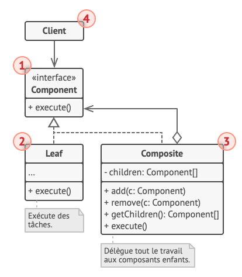

# Communication a Ippon

## Contexte

Imaginez que vous travaillez dans une entreprise de développement immaginaire appelée "Ippon technologies".
L'entreprise a une structure hiérarchique avec plusieurs niveaux de gestion, comprenant Stephane Nomis, des chefs d'agence et des collaborateurs.
On va essayer de modeliser cette communication au sein de l'entreprise et appliquer le Patron Composite pour représenter et gérer la structure de communication.

## Partie 1 : Implémentation Directe du Patron Composite

Objectif : Mettre en place la structure de communication en utilisant le Patron Composite et démontrer le flux d'information entre Stephane Nomis et les collaborateurs

- Faire en sorte que Stephane Nomis envoie la date du prochain All hand à tout le monde
  - Définir des classes pour Stephane Nomis, les chefs d'agence et des collaborateurs qui étendent une classe Person.
  - Créer une classe composite qui représente la structure de communication de l'entreprise.
  
- Comment faire si notre chef d'agence veut nous dire de rentrer la poubelle ?

## Partie 2 : Compléxification de notre modéle

Objectif : Oh merde on avait oublié les stagiaire ! En plus le grand chef voudrait savoir combien lui coute les salaires des collaborateurs

- Crée une classe Stagiaire et l'ajouter a notre structure
- Rajouter une fonction dans notre pattron afin de pouvoir calculer le cout des collaborateurs

## Partie 3 : Bonus (Optionnel)
Objectif : Explorer les limites du Patron Composite dans la représentation de certains scénarios de communication et discuter des solutions potentielles.

- Comment faire dans le cas ou stephanes Nomis veut directement contacter Merlin pour participer à son kata ?

## Conclusion

  
Recap

  

  - Ajout facile d'élément dans notre structure
  - Ajout d'actions très simple

